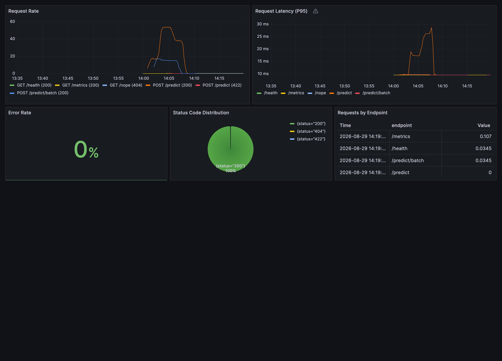
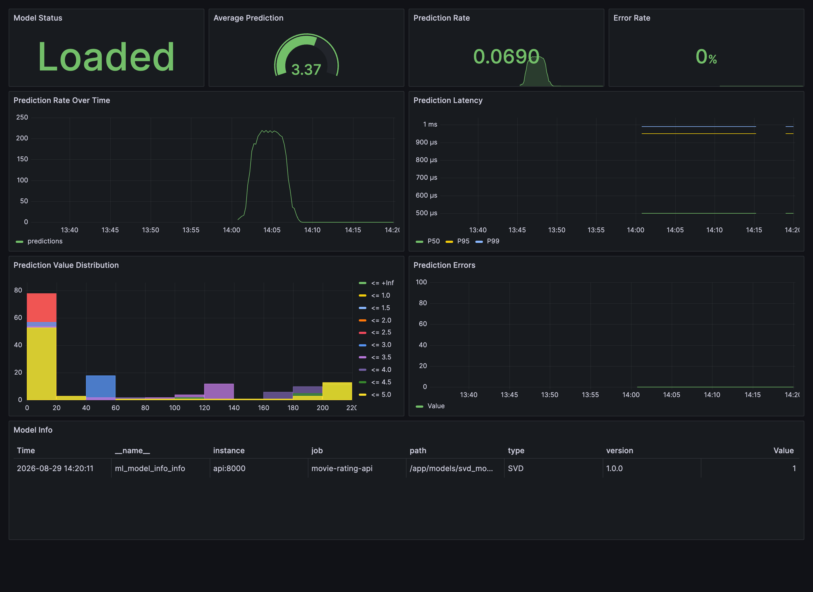
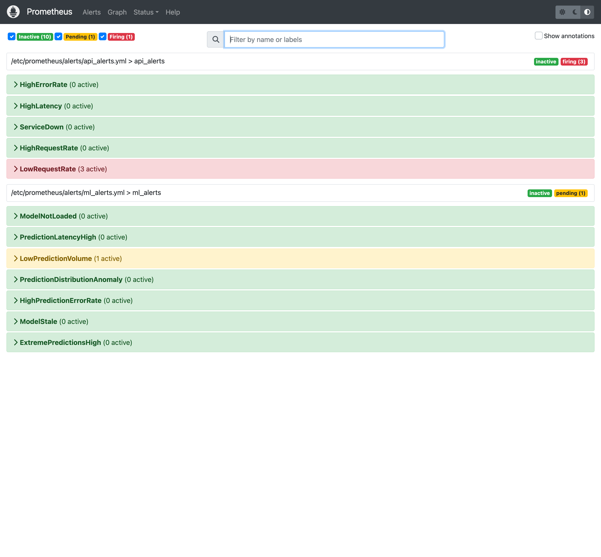
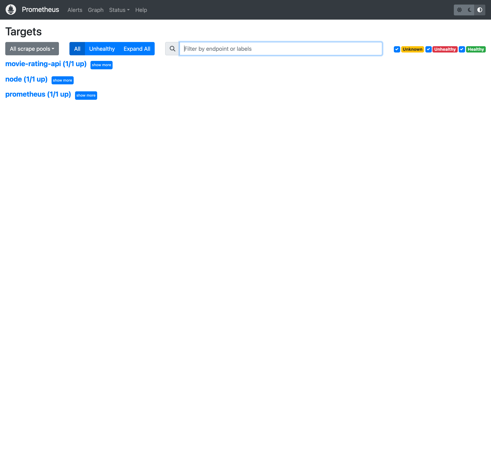

# Lab 4: Monitoring & Production Deployment

A production-style movie rating API with Prometheus metrics, Grafana dashboards, alert rules, and a load-testing script. This lab extends the movie-rating model from the earlier labs and adds the observability layer used in a real deployment.

## What is included

- FastAPI API with `/predict`, `/predict/batch`, `/health`, `/metrics`, and `/model/info`
- Prometheus metrics for HTTP traffic, model health, prediction latency, and prediction errors
- Grafana dashboards for system metrics and ML metrics
- Prometheus alert rules for API health and model health
- A load-testing script to generate traffic and populate the dashboards

## Project structure

```text
ddm501-lab4-starter/
├── app/
│   ├── main.py
│   ├── model.py
│   ├── metrics.py
│   ├── middleware.py
│   ├── config.py
│   └── schemas.py
├── prometheus/
│   ├── prometheus.yml
│   └── alerts/
│       ├── api_alerts.yml
│       └── ml_alerts.yml
├── grafana/
│   ├── provisioning/
│   │   ├── datasources/
│   │   │   └── prometheus.yml
│   │   └── dashboards/
│   │       └── dashboards.yml
│   └── dashboards/
│       ├── system_dashboard.json
│       └── ml_dashboard.json
├── scripts/
│   ├── train_model.py
│   └── load_test.py
├── docker-compose.yml
├── Dockerfile
├── requirements.txt
└── README.md
```

## Prerequisites

- Python 3.13 for the local Windows venv, or Docker for the containerized stack
- Docker and Docker Compose
- About 4 GB free disk space for the monitoring containers
- A trained model file at `models/svd_model.pkl`

## Local setup

Create a virtual environment and install the local dependencies:

```bash
cd ddm501-lab4-starter
python -m venv venv
venv\Scripts\activate
pip install -r requirements.txt
```

The local pin set is chosen to install cleanly on Windows Python 3.13. The Docker image uses Python 3.10-slim and the same application code.

## Model handoff from earlier labs

This lab does not train a new model by itself. It loads the movie-rating model
from `models/svd_model.pkl`, so the file must come from a previous training run
in Lab01.1 or from `python scripts/train_model.py` in this lab.

The practical workflow is:

1. Train the model in Lab01.1 or Lab02.2.
2. Copy the resulting `svd_model.pkl` into this lab's `models/` folder.
3. Start the API from this lab's root directory so `app.main` can be imported.

If the model file is missing, train it first:

```bash
python scripts/train_model.py
```

## Run the API

Start the API locally:

```bash
uvicorn app.main:app --reload --host 0.0.0.0 --port 8000
```

Useful endpoints:

- `http://localhost:8000/health`
- `http://localhost:8000/metrics`
- `http://localhost:8000/docs`

## Run the monitoring stack

Start the full stack with Prometheus and Grafana:

```bash
docker compose up -d --build
```

Services:

| Service | URL |
|---|---|
| API | http://localhost:8000 |
| Prometheus | http://localhost:9090 |
| Grafana | http://localhost:3000 |

Grafana uses the default credentials `admin` / `admin`.

Stop everything with:

```bash
docker compose down
```

## Load testing

Run a basic load test against the API:

```bash
python scripts/load_test.py --duration 60 --workers 10
```

Batch mode:

```bash
python scripts/load_test.py --duration 60 --workers 10 --batch
```

Spike test:

```bash
python scripts/load_test.py --spike --workers 10
```

## Metrics exported

The API exposes these series at `/metrics`, scraped by Prometheus every 10 s:

- `http_requests_total`
- `http_request_duration_seconds`
- `ml_predictions_total`
- `ml_prediction_duration_seconds`
- `ml_prediction_value`
- `ml_prediction_errors_total`
- `ml_model_loaded`
- `ml_model_info_info`
- `ml_model_last_reload_timestamp`
- `ml_batch_prediction_size`

Panel-by-panel documentation is in [Dashboards](#dashboards) below.

## Load test report

Measured on 2026-08-29, Apple Silicon, full stack in Docker Compose, model
`svd_model.pkl` (SVD, MovieLens 100K). Client numbers come from
`scripts/load_test.py`; server numbers from Prometheus over the same window.

### Client-side results

| Scenario | Requests | Success | RPS | Mean | P50 | P95 | P99 | Max |
|---|--:|--:|--:|--:|--:|--:|--:|--:|
| Single, 60 s, 10 workers | 4,880 | 100.00% | 81.3 | 16.02 ms | 15.72 ms | 20.10 ms | 37.21 ms | 44.46 ms |
| Batch (3 items), 60 s, 10 workers | 4,800 | 100.00% | 80.0 | 17.86 ms | 17.67 ms | 22.55 ms | 37.20 ms | 45.73 ms |
| Spike, 10 workers | 2,440 | 100.00% | 81.3 | 16.43 ms | 16.24 ms | 19.90 ms | 37.53 ms | 42.79 ms |

Zero failed requests across 12,120 requests.

### Server-side view

| Metric | Value |
|---|---|
| `http_requests_total` — `/predict` | 15,750 (200) + 60 (422) |
| `http_requests_total` — `/predict/batch` | 4,800 |
| Total predictions served | 63,750 |
| p95 HTTP latency, `/predict` | 17.4 ms |
| **p95 model inference latency** | **0.9 ms** |
| Mean predicted rating | 3.37 |
| Prediction errors | 0 |

### What the numbers say

**Inference is 5% of the request.** p95 model latency is 0.9 ms against a 17.4 ms
p95 HTTP latency, so roughly 95% of the time a user waits is framework overhead —
request parsing, Pydantic validation, JSON serialisation — not the model. Any
latency work should start there, and swapping in a faster model would be close to
a rounding error. This is exactly the kind of conclusion the client-side number
alone cannot support: the load test says "17 ms", only the ML metric says why.

**Batch is barely cheaper per request than single.** 17.86 ms for a 3-item batch
against 16.02 ms for one prediction. Since inference itself is 0.9 ms, batching
amortises almost nothing — it saves two round trips, not two inferences. Batching
is a network optimisation here, not a compute one.

**The tail is 2x the median and flat across scenarios.** P99 sits at ~37 ms in all
three runs while P50 stays near 16 ms. A tail that does not move with load is
usually the runtime rather than contention — GC pauses and scheduler jitter — so
throughput headroom is not the constraint at this level.

**Alerting was exercised, not just configured.** After the load stopped,
`LowRequestRate` moved to *firing* and `LowPredictionVolume` to *pending*, which is
the intended behaviour: a silent API is a failure mode this system reports rather
than one it sleeps through. See `docs/screenshots/03-prometheus-alerts.png`.

## Dashboards

Both dashboards are provisioned automatically from `grafana/dashboards/` and are
wired to the Prometheus datasource by the pinned UID `prometheus`.

### System Metrics Dashboard — *is the service healthy?*



| Panel | Question it answers | Read it as |
|---|---|---|
| Request Rate | Is traffic arriving, and on which endpoints? | Flat zero during market-open hours means the client, not the API, is broken |
| Request Latency (P95) | Are users waiting? | Baseline ~17 ms on `/predict`. Sustained > 500 ms triggers `HighLatency` |
| Error Rate | What fraction of responses are 5xx? | 4xx is deliberately excluded: a rejected malformed request is the API working. Sustained > 5% triggers `HighErrorRate` |
| Status Code Distribution | What *kind* of failure? | A rising 422 share means clients are sending bad payloads; a rising 5xx share means we are |
| Requests by Endpoint | Which route carries the load? | Used to size capacity and to spot an endpoint being hammered unexpectedly |

### ML Metrics Dashboard — *is the model behaving?*



| Panel | Question it answers | Read it as |
|---|---|---|
| Model Status | Is a model loaded at all? | `Loaded` / `Not loaded`. Anything but Loaded fires `ModelNotLoaded` within 60 s |
| Average Prediction | Has the output distribution shifted? | Baseline ≈ 3.37 on MovieLens. Drifting toward 1 or 5 fires `PredictionDistributionAnomaly` — the cheapest available proxy for model drift without ground truth |
| Prediction Rate | Is the model actually being called? | Distinct from Request Rate: a request that fails validation never reaches the model |
| Error Rate | Are predictions raising? | 0% here. Shows a truthful 0 rather than "No data" before the first error |
| Prediction Rate Over Time | Traffic shape over the window | Peak ~220 predictions/s during the load test |
| Prediction Latency (P50/P95/P99) | How fast is inference itself? | Sub-millisecond. Compare against Request Latency to separate model cost from framework cost |
| Prediction Value Distribution | What shape are the outputs? | Histogram buckets over the 1–5 rating scale. A collapse to one bucket means the model has stopped discriminating |
| Prediction Errors | Which error types, over time? | Broken out by `error_type` so a spike is attributable |
| Model Info | Which model version is live? | Reads `ml_model_info_info` — version, type and path of the artefact currently loaded |

### Alert rules



12 rules in two groups. `for:` durations are chosen so a brief blip does not page:

| Group | Alert | Fires when | `for` |
|---|---|---|---|
| api | `ServiceDown` | Target unreachable | 1 m |
| api | `HighErrorRate` | 5xx share above threshold | 2 m |
| api | `HighLatency` | p95 above threshold | 5 m |
| api | `HighRequestRate` / `LowRequestRate` | Traffic outside the expected band | 5 m / 10 m |
| ml | `ModelNotLoaded` | `ml_model_loaded == 0` | 1 m |
| ml | `PredictionLatencyHigh` | Inference p95 above threshold | 5 m |
| ml | `LowPredictionVolume` | Model not being called | 15 m |
| ml | `HighPredictionErrorRate` | Prediction errors rising | 5 m |
| ml | `PredictionDistributionAnomaly` | Mean prediction drifted | 30 m |
| ml | `ExtremePredictionsHigh` | Outputs pinned to the scale edges | 1 h |
| ml | `ModelStale` | No reload within the expected window | 1 h |



## Recommended workflow

1. Create the venv and install dependencies.
2. Train the model if `models/svd_model.pkl` is missing.
3. Start `docker compose up -d --build`.
4. Open Grafana and confirm the dashboards are populated.
5. Run the load test to generate traffic and verify the charts.

## Troubleshooting

- If the API returns `503`, check that `models/svd_model.pkl` exists.
- If you see `ModuleNotFoundError: No module named 'app'`, run the command
	from `Lab02.2/ddm501-lab4-starter` or use `python -m uvicorn app.main:app --app-dir .`.
- If the Error Rate panel shows `No data`, that usually means there were no 5xx
	responses in the selected time range. Generate some requests, or trigger an
	error and refresh the panel.
- If Prometheus shows no targets, confirm the API container is running and that `prometheus.yml` points to `api:8000`.
- If Grafana shows empty dashboards, verify that the Prometheus datasource has loaded and that the stack was started with `docker compose up -d --build`.
- If local installation fails on Python 3.13, recreate the venv with the bundled requirements in this folder.
